### VueJS Débutant

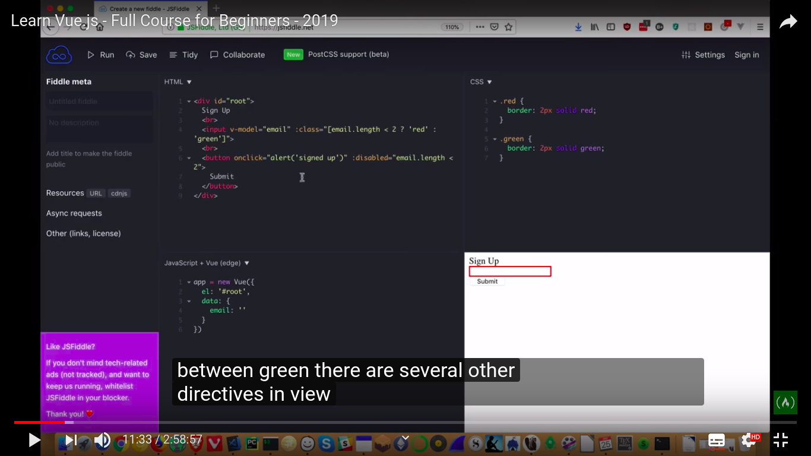

Ici, l'id "Root" dans le HTML est branché à l'élément dans l'instance de VueJS, celà permet de l'intéraction avec le DOM

Le **v-model** est une directive connecté à **L'input** et branché à **L'email** indiqué dans la **Data** de **l'instance de vue** permet de faire transiter les infos dans les deux sens, **:class** permet d'appliquer une classe CSS (ici sous condition ternaire, sous 2 le cadre est **rouge**, au dessus il passe au **vert**)

**onclick** est un **écouteur d'évènement** qui déclenche une alerte dans ce cas ci, et le bouton est **:disabled** si le contenu de l'input est inférieur à 2, celui-ci sera **incliquable**

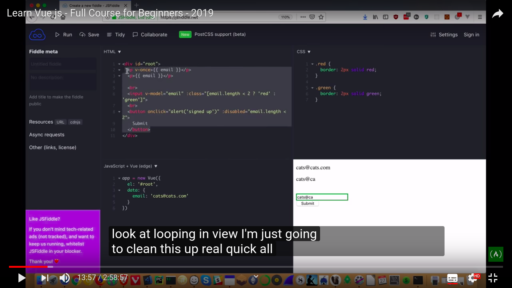

Ici, **l'interpolation** (les doubles accolades, ou moustaches) permet d'adapter le contenu de la balise 
 (dans ce cas-ci) au contenu de **email** indiqué dans la data, l'email **cats@cats.com** écrit en dur permet juste de démontrer que le v-once bloque **toute nouvelle tentative de modification dans l'input**

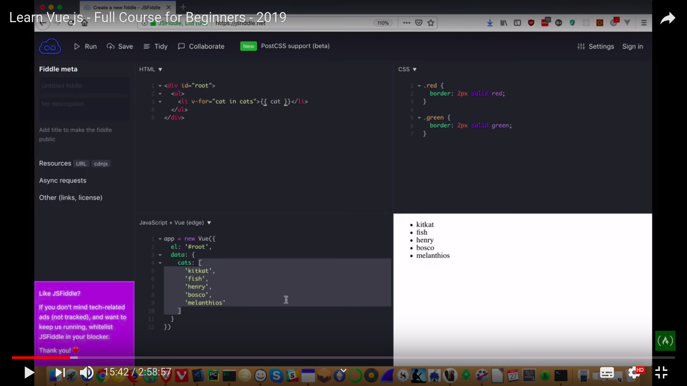

Ici, on indique dans la data **cats**, qui est un **tableau**, des noms de chats écrits en dur

Grâce à la directive **v-for**, branchée à une **li** dans ce cas-ci, javascript va boucler dans **cats**, on utilise ensuite une **interpolation** afin de display les noms de chats sous forme de **li** de l'index 0 du **tableau** jusqu'au dernier

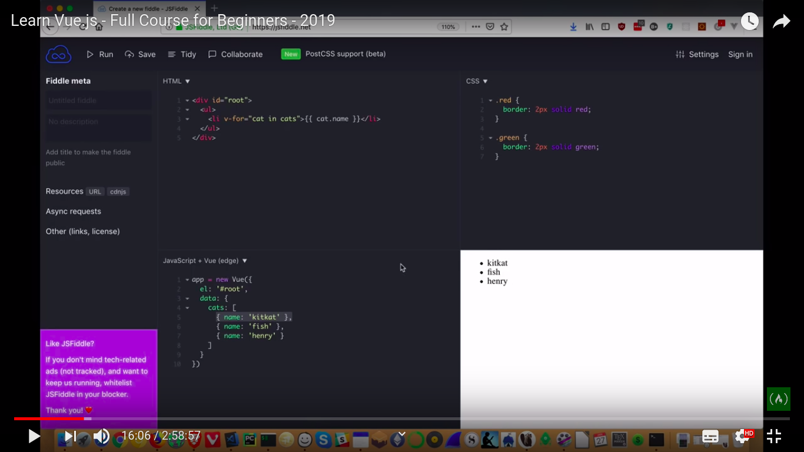

Ici même chose, nous pouvons boucler dans un tableau **d'objets**, on indique dans **l'interpolation** que l'on veut boucler dans le **nom** des chats par un "**.quelquechose**"

Ici, le **v-model** est branché sur **l'input** et sur **newCat** dans **data**, qui est à la base, un **string vide**, le **v-on:click** branché sur le bouton va déclencher l'évènement **addKitty**, qui fait appel à une **fonction** écrite dans **methods**, cette fonction va push dans **cats**, qui est, je le rappelle **un tableau d'objets**, un nouvel **objet** "**stringifié**" avec comme clé **name** et comme valeur le contenu de **l'input**

Ici, on a ajouté un nouvel **écouteur d'évènement**, qui est sur keyup, si on ne précise pas une touche, n'importe quelle touche activera **addKitty**, d'où la précision **.enter** pour indiquer seulement la touche **entrée**

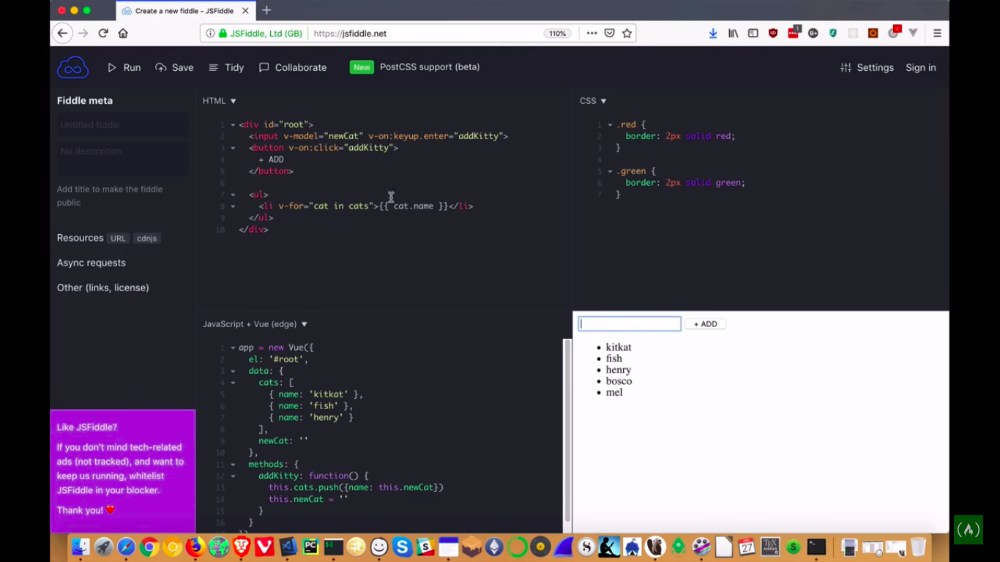

Simple modification afin de **clean** l'input, la methode **addKitty** se voit ajouter une string vide sur **l'input** où est branché le **v-model**

il est possible d'ajouter des **filters**, ici indiqué par les **pipes** dans **l'interpolation**, juste après le **v-for**, ces indiquations vont **trigger** la **fonction** capitalize puis la **fonction** kittify

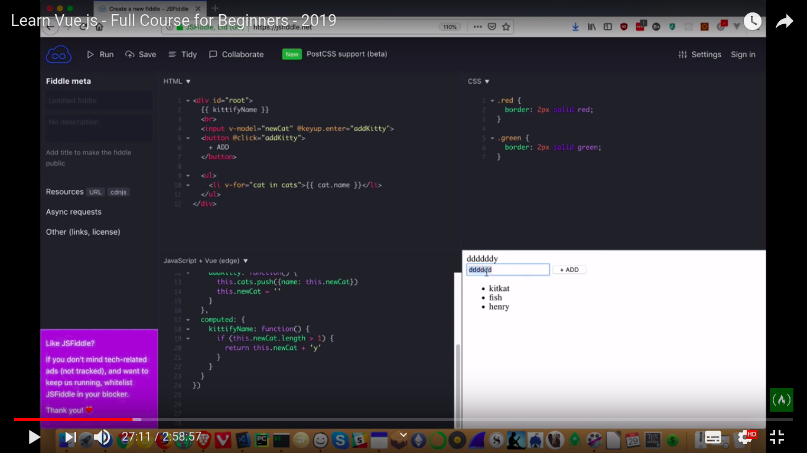

Une **computed property** est une fonction "**greffée**", qui permet d'alléger

En effet, une propriété calculée sera réévaluée uniquement quand certaines de ses dépendances auront changé. Cela signifie que tant que **newCat** n’a pas changé, les multiples accès à la propriété calculée **kittifyName** retourneront immédiatement le résultat précédemment calculé sans avoir à réexécuter la fonction.

Nous pouvons aussi utiliser une méthode, mais celle-ci peut être couteuse en performance sur de grands tableaux, la doc de VueJS à propos des **computed properties** est à revoir

Mais grosso modo, il s'agit d'améliorer les performances dans certains cas

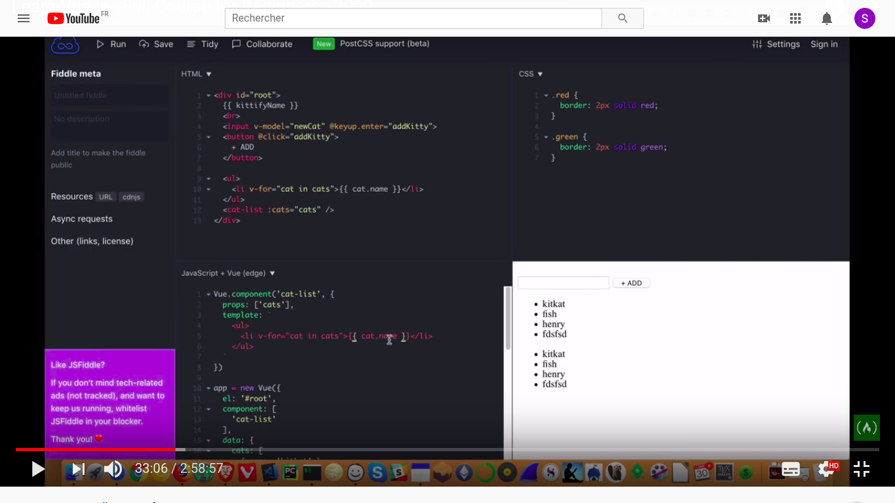

Ici, nous abordons la notion de composant, il est crée dans ce cas ci, dans une instance "**component**", avec le nom du composant (cat-list), nous avons utilisé la directive **v-bind** dans le HTML dans la **balise auto fermante** incluse dans la balise racine (#root), avec dans son template la même **li** contenant le **v-for**, un **v-bind** à un endroit nécessite que l'on le lie grâce au **props** dans le script de l'endroit où nous incluons ce fameux **composant**

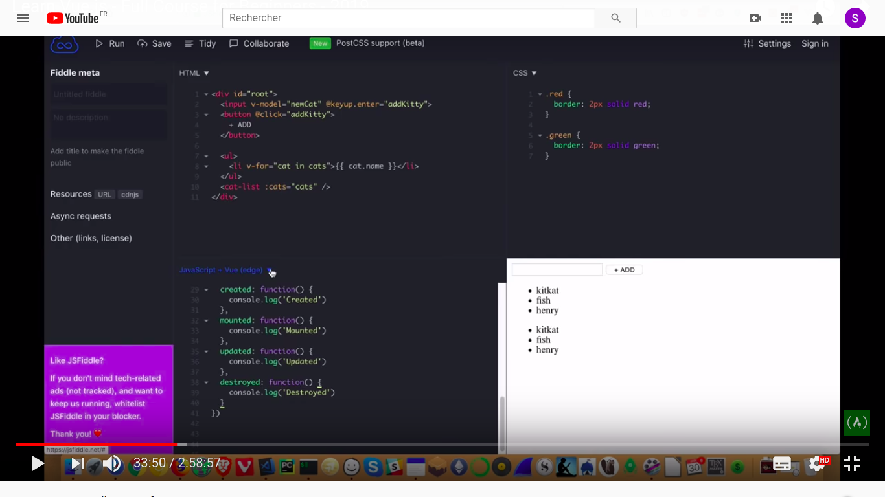

Ci-dessus, il s'agit des cycles de vie. Voir les cycles de vie, **IMPORTANT**

[Cycles de vie VueJS](https://fr.vuejs.org/v2/guide/instance.html)

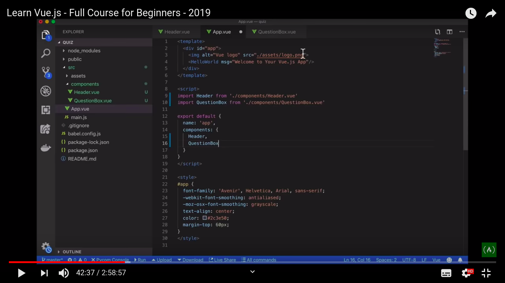

Ci-dessus, nous abordons vue CLI, **vue create 'nom du dossier'** crée un boiler plate (en fonction des parametres de création), avec une arborescence préconçue, le point d'injection se trouve sur une **id** app dans le /public HTML, monté à partir de main.js, qui a sa source en **App.vue**, ici, deux fichiers de **composants** (dans components) ont été crées (**Header.vue et QuestionBox.vue**), ceux-ci ont été exportés dans une balise script, puis importés dans **App.vue**, dans le script donc, via "**import xxx from 'xxx'**, utilisés dans une balise auto fermante dans le **template** (non affiché sur le screenshot) puis exportés dans la section **components** du script d'**App.vue** afin que le main.js l'injecte dans l'**HTML**

L'ordre dans lequel sont "**utilisés**" les composants dans le template compte, le **Header** appelé **avant**, sera donc au dessus de **QuestionBox** appelé **en dessous**

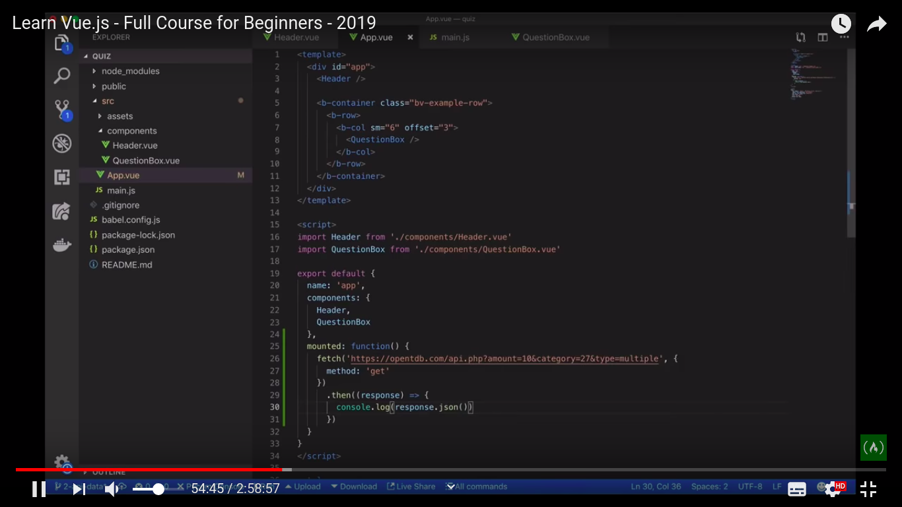

Ci-dessus, nous avons un exemple de **consommation d'API**, nous indiquons dans le script d'**App.vue** quand nous **souhaitons** exécuter la fonction anonyme, qui va **GET** les informations de l'**API** via l'**URL** et **fetch** (équivalent d'**Axios** mais qui est inné dans **Javascript**, donc **indépendant**)

Dans cet exemple, la **fonction** sera executée lors du **cycle de vie** **MOUNTED**.

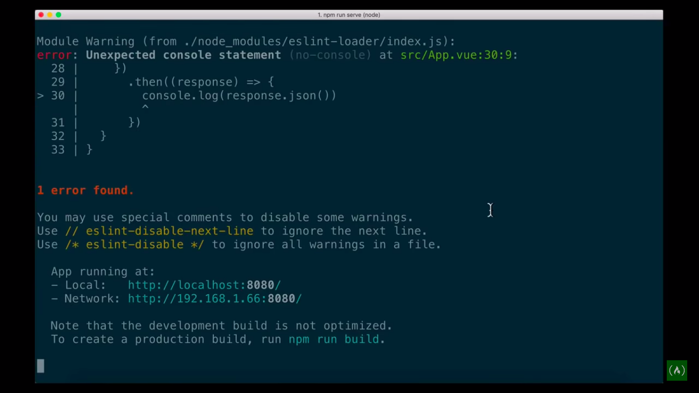

Le **console.log** du screenshot du dessus pose problème, en effet, il n'accepte pas de CL dans le script, pour régler ceci, il faut se rendre ici: 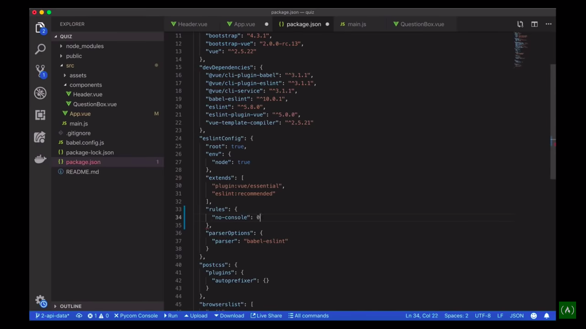 et insérer dans **rules** le no-console: false ou 0